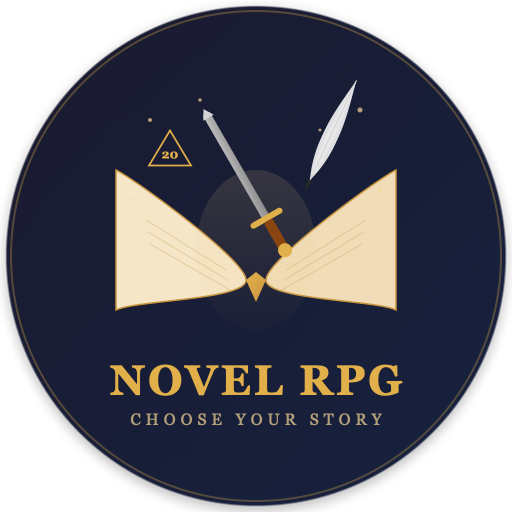

<p align="center">
  
</p>

<h1 align="center">Novel RPG - 名著角色扮演闯关</h1>

<p align="center">
  <a href="https://www.npmjs.com/package/novel-rpg-skill"></a>
  <a href="https://github.com/kiki123124/novel-rpg"></a>
  <a href="https://github.com/kiki123124/novel-rpg/blob/main/LICENSE"></a>
</p>

> Interactive classic novel RPG skill for AI assistants. Role-play as characters from world literature, make choices that reshape the story.

适用于 OpenClaw / Claude Code 等 AI 助手的交互式名著角色扮演闯关游戏。

## Demo

```
你：开始名著RPG
AI：可选书籍：呼啸山庄、西游记...

你：呼啸山庄，我选希斯克利夫
AI：1801年冬，约克郡荒原。你站在呼啸山庄的门廊下，寒风裹挟着枯叶...
    一个陌生人来访。你选择：
    1. 以冷漠回应来客，维持孤僻形象
    2. 试着表现出一丝礼貌
    3. 直接拒绝来客进门
```

## Features

- **Built-in novels**: Wuthering Heights (10 chapters, 4 characters, 30 scenes) + Journey to the West (10 chapters, 4 characters, 27 scenes)
- **PDF import**: Import any novel, auto-detect chapters, extract characters, generate scene graph
- **Multi-perspective**: Same story, different character POV, different choices
- **Stats system**: wisdom / combat / loyalty / reputation affect available options
- **Divergence tracking**: Follow the canon or forge your own parallel timeline
- **Save system**: Progress persists across sessions

## Install

### npx (recommended)

```bash
npx novel-rpg-skill
```

### curl

```bash
curl -fsSL https://raw.githubusercontent.com/kiki123124/novel-rpg/main/install.sh | bash
```

### git clone

```bash
git clone https://github.com/kiki123124/novel-rpg.git ~/.openclaw/skills/novel-rpg
python3 ~/.openclaw/skills/novel-rpg/scripts/book_manager.py init-builtins
```

### Update / Uninstall

```bash
npx novel-rpg-skill update
npx novel-rpg-skill uninstall
```

### Optional: PDF import

```bash
pip3 install PyMuPDF
```

## Usage

Tell your AI: "名著RPG", "novel rpg", "start adventure", "开始冒险"

### Import your own novel

```bash
python3 scripts/pdf_import.py import "book.pdf" --book-id my-book --title "Book Title"
```

## Built-in Books

| Book | Characters | Scenes | Language |
|------|-----------|--------|----------|
| Wuthering Heights (呼啸山庄) | Heathcliff, Catherine, Nelly, Edgar | 30 | EN/ZH |
| Journey to the West (西游记) | 孙悟空, 唐僧, 猪八戒, 沙僧 | 27 | ZH |

## How It Works

1. **Choose a book** → AI loads structured scene graph (not full text = token efficient)
2. **Choose a character** → Your POV, stats, and relationships initialize
3. **Play scenes** → AI narrates from your perspective, presents 2-4 choices per scene
4. **Choices matter** → Stats change, relationships shift, story diverges from canon
5. **Save anytime** → Resume across sessions, replay as different characters

## CLI Commands

```bash
python3 scripts/book_manager.py list                              # List books
python3 scripts/book_manager.py characters wuthering-heights      # Show characters
python3 scripts/game_engine.py new-game wuthering-heights heathcliff  # New game
python3 scripts/game_engine.py list-saves                         # List saves
python3 scripts/scene_retriever.py context wuthering-heights ch09_s01 # Scene context
```

## License

MIT
